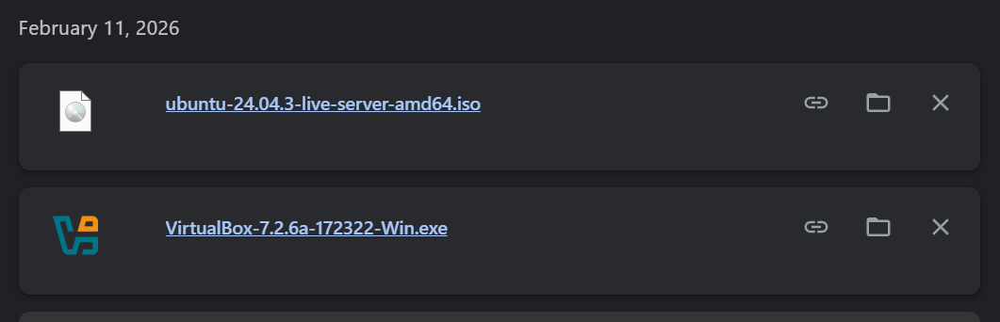
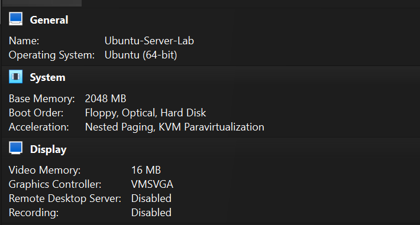
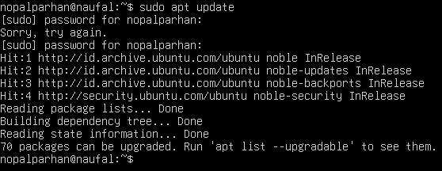
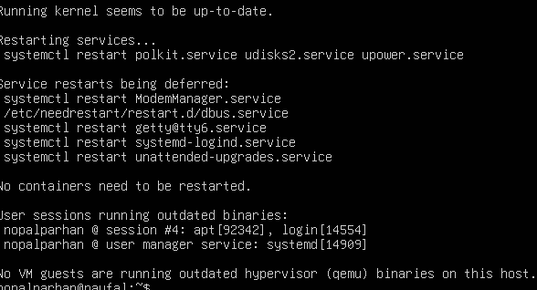
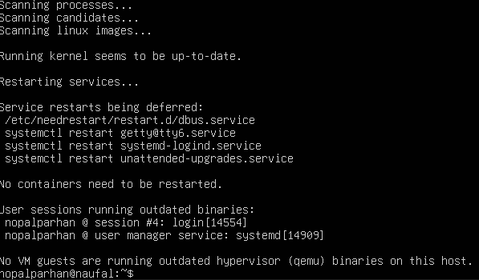
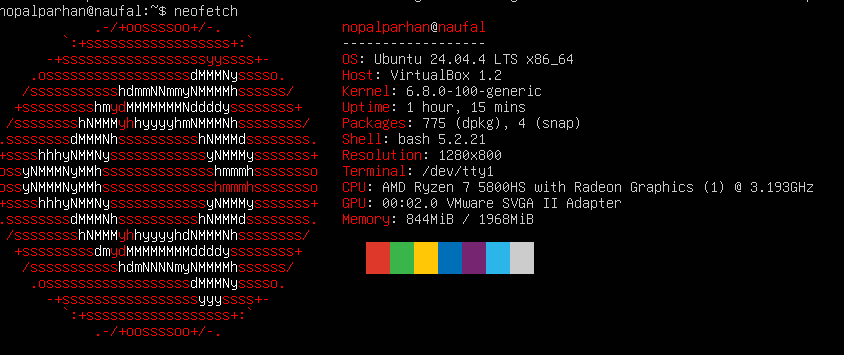
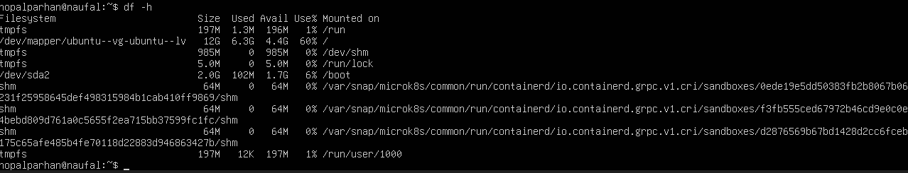
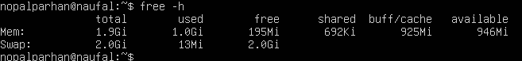

#JOBSHEET-1

## 1.10.1. Latihan Konseptual
### 1.Jelaskan 5 fungsi utama sistem operasi dengan contoh konkret dari minimal 2
OS berbeda (Windows, macOS, atau Linux)

5 Fungsi utama sistem operasi adalah :
1. Sebagai Manajamen Proses
2. Manajemen Memori
3. Manajemen File
4. Manajemen Perangkat Input/Output
5. Manajemen Keamanan

Contoh konkret : 
1. OS Linux untuk keamanan karna Linux memiliki sistem enkripsi yang ketat
2. Windows dengan manajemen proses nya karna dapat membagi prioritas daya prosesor ke aplikasi atau game berat

### 2.Kapan sebaiknya menggunakan Windows vs Linux vs macOS? Analisis
berdasarkan use case: gaming, development, server, creative work, dan enterprise.
Gaming : Windows 
karna ada dukungan dari DirectX dan kompabilitas kartu grafis (NVIDIA/AMD)

Programming  : Linux
Karna mayoritas server di dunian menggunakan Linux

Creative Work : MacOS
Karna MacOS memiliki daya rendering yang bagus, dan Layar Retina meiliki akurasi warna yg tajam

## 1.10.2. Latihan Praktikal
1. Download Ubuntu Server ISO dari website resmi
2. Create VM baru di VirtualBox (RAM: 2GB, Disk: 25GB)
3. Install dengan automatic partitioning (guided)
4. Buat user account dengan password yang kuat
5. Reboot dan login ke sistem

Setelah instalasi Ubuntu Server, lakukan tasks berikut:
1. Update package list: sudo apt update

2. Upgrade packages: sudo apt upgrade

3. Install neofetch: sudo apt install neofetch

4. Jalankan neofetch dan screenshot hasilnya

5. Check disk usage dengan df -h

6. Check memory dengan free -h

Eksplorasi sistem yang baru diinstall:
1. Tampilkan informasi OS: cat /etc/os-release
2. Tampilkan versi kernel: uname -r
3. List partisi: lsblk
4. Check network connectivity: ping -c 4 google.com
5. Install dan jalankan htop untuk melihat resource usage

## 1.10.3. Latihan Refleksi
Ceritakan pengalaman Anda dengan sistem operasi:
1. Sistem operasi apa yang Anda gunakan sehari-hari? (Windows, macOS,
Linux, atau lainnya)

2. Berapa lama Anda menggunakan sistem operasi tersebut?

3. Apa yang Anda sukai dari sistem operasi tersebut?

4. Apa tantangan atau masalah yang pernah Anda hadapi?

5. Apakah Anda pernah menggunakan sistem operasi lain? Bandingkan
pengalaman Anda.

6. Setelah mempelajari bab ini, apakah ada sistem operasi lain yang ingin
Anda coba? Mengapa?

Tulis refleksi Anda dalam 300-500 kata disertai dengan dokumentasi.

Selama kurang lebih 12 tahun, Windows telah menjadi sistem operasi utama yang saya gunakan Alasan utama saya bertahan 
selama lebih dari satu dekade adalah karena Windows sangat simpel dan all-rounded. Sistem ini menawarkan fleksibilitas luar biasa;
hampir semua jenis perangkat lunak yang saya butuhkan, mulai dari urusan tugas hingga hiburan, tersedia dan mudah dijalankan. Namun,
tantangan terbesar yang sering saya hadapi adalah kerentanan terhadap virus dan malware. Sebagai OS yang paling banyak digunakan, 
Windows menjadi sasaran empuk serangan siber, sehingga saya harus ekstra waspada saat mengunduh file agar sistem tetap aman.

Sebenarnya, Windows bukan satu-satunya sistem operasi yang pernah saya gunakan. Saat masih duduk di bangku Sekolah Dasar (SD), 
saya sempat bersentuhan dengan Ubuntu (Linux) untuk kebutuhan praktik di sekolah. Meskipun interaksinya cukup singkat, pengalaman
tersebut memberikan gambaran bahwa ada sistem operasi lain yang lebih ringan dan aman, meskipun memerlukan penyesuaian lebih pada
antarmukanya dibandingkan Windows yang sudah sangat akrab bagi saya.

Setelah mempelajari materi mengenai sistem operasi ini, saya merasa sangat tertarik untuk mencoba macOS. Ketertarikan ini muncul karena 
ambisi saya untuk mendalami dunia editing gambar. Reputasi macOS dalam hal kestabilan sistem serta akurasi warna yang tinggi pada layar 
perangkat Apple menjadi daya tarik yang sulit diabaikan. Saya ingin merasakan sendiri bagaimana efisiensi kerja yang ditawarkan macOS 
dalam menangani aplikasi kreatif yang berat tanpa kendala teknis yang berarti. Setelah belasan tahun terbiasa dengan Windows, mengeksplorasi
ekosistem baru yang berfokus pada sisi kreatif akan menjadi langkah pengembangan diri yang sangat menarik bagi saya.

