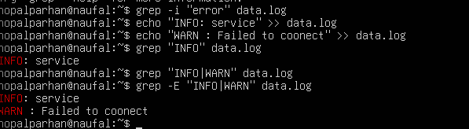
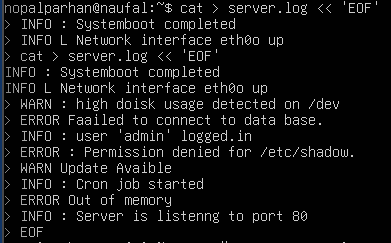
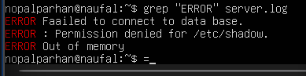
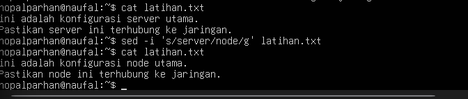

# Jobsheet-2

## Latihan 2.1
Catat: (1) jumlah CPU(s), core/thread, (2) total RAM, (3) total swap. Jelaskan perbedaan RAM vs swap dalam 2–3 kalimat.

RAM adalah memori fisik utama yang digunakan untuk menyimpan data proses yang sedang berjalan secara cepat, sedangkan Swap
adalah ruang di dalam disk (penyimpanan) yang digunakan sebagai cadangan ketika RAM sudah penuh. Karena RAM berbasis 
perangkat keras memori dan Swap berbasis disk, kecepatan akses RAM jauh lebih cepat dibandingkan dengan Swap.

## Latihan 2.2
Temukan 1 perangkat PCI (misal NIC) dan tuliskan: Vendor:Device ID (angka
heksadesimal), nama driver/modul kernel, dan deskripsi singkat fungsinya.

Vendor:Device ID (angka heksadesimal): 8086:100e
Nama Driver/Modul Kernel: e1000
Deskripsi Singkat Fungsi: Perangkat ini adalah Intel 82540EM Gigabit 
Ethernet Controller, yang berfungsi sebagai antarmuka jaringan (NIC)
untuk menghubungkan komputer ke jaringan kabel

## Latihan 2.3
Dari output ls -l, jelaskan perbedaan penanda file untuk block device dan
character device. (Hint: karakter pertama pada permission string)

Perbedaan penanda file pada output ls -l terletak pada karakter pertama string
izin (permission string): jika diawali dengan huruf b, maka perangkat tersebut
adalah block device yang diakses dalam unit blok data seperti disk atau partisi , 
sedangkan jika diawali dengan huruf c, maka perangkat tersebut adalah character 
device yang diakses sebagai aliran karakter berurutan seperti terminal atau perangkat serial

## Latihan 2.4
Gunakan grep untuk menampilkan hanya baris yang mengandung INFO atau
WARN dari data.log. (Hint: gunakan grep -E dengan pola alternatif)

## Latihan 2.5
Pilih satu port yang listening dari output ss -tulpn(misal port 22), lalu
tuliskan service/proses yang membukanya. Jelaskan kegunaan port tersebut
secara singkat.

Port : 22
yang Membuka : sshd
Kegunaan Port: Port 22 digunakan oleh protokol SSH (Secure Shell) untuk memungkinkan akses 
administrasi jarak jauh ke server secara aman melalui koneksi terenkripsi.

# 1.9 Latihan

## Latihan 2.A
Jalankan lspci -nnk. Pilih 1 perangkat PCI dan tuliskan: nama perangkat,
ID vendor:device, dan kernel driver in use.

Nama Perangkat: Intel Corporation 82540EM Gigabit Ethernet Controller.
ID Vendor:Device: 8086:100e.
Kernel Driver in Use: e1000

## Latihan 2.B
Tentukan device root filesystem dengan findmnt /. Lalu cocokkan dengan
lsblk -f dan tuliskan tipe filesystem serta UUID-nya.

Device Root Filesystem: /dev/mapper/ubuntu--vg-ubuntu--lv
Tipe Filesystem: ext4
UUID: 0515e1dc-e56a-40d7-b294-53e14e35a3b2

## Latihan 2.C
Buat file server.log berisi minimal 10 baris dengan variasi kata: INFO,
WARN, ERROR. Gunakan grep untuk menampilkan hanya baris ERROR.

## Latihan 2.D
Gunakan sed untuk mengganti semua kata server menjadi node pada file
latihan. Tunjukkan sebelum dan sesudah.

## Latihan 2.E
Gunakan df -h lalu awk untuk menampilkan filesystem yang penggunaan disk
di atas 70%.

(di saya tidak ada yang lebih dari 70%)

## Latihan 2.F
Jalankan sleep 600 &. Temukan PID-nya dengan ps. Hentikan dengan
SIGTERM. Jelaskan beda SIGTERM vs SIGKILL.

Perbedaan SIGTERM vs SIGKILL
Berdasarkan konsep manajemen proses dalam dokumen:

SIGTERM (Sinyal 15): Adalah permintaan penghentian secara "sopan" 
atau graceful. Sinyal ini memberi kesempatan pada aplikasi untuk menyimpan 
data, menutup koneksi, dan membersihkan file sementara sebelum benar-benar berhenti.

SIGKILL (Sinyal 9): Adalah penghentian paksa atau force stop. Sinyal ini 
tidak bisa diabaikan oleh aplikasi; sistem operasi akan langsung mematikan
proses tersebut seketika tanpa memberikan waktu bagi aplikasi untuk melakukan persiapan penutupan

## Latihan 2.G
Gunakan systemctl –failed. Jika tidak ada yang gagal, pilih satu service
aktif (misal ssh) dan tampilkan status serta 30 baris log terakhirnya.

